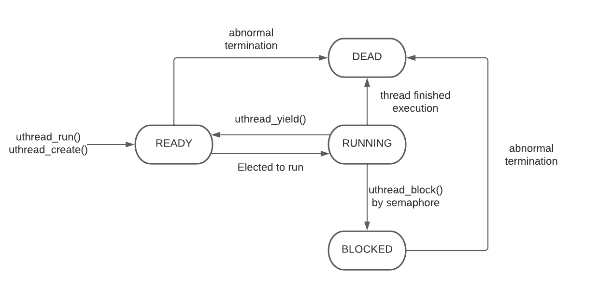

# User Thread Library
## Summary
The library, `libuthread.a` is an API for a basic user level thread library
for Linux. This library allows users to create threads to run functions
concurrently. Threads are scheduled through a FIFO(First In First Out) queue.
Packaged with the library, there is race condition protections through the 
use of semaphors. Starvation is prevented using preemptive measures by cycling
multiple threads in a round-robin measure until completion.

## Implementation
There were 5 key parts to creating our library:
1. Designing a simple queue
2. Implementing a thread API to provide a multithreading interface
3. Creating a sempahore API to direct resource access of threads
4. Integrating preemption into our multithreading interface
5. Error handling

## Queue
The queue is a FIFO queue, which requires all operations except delete and 
iterate to be `O(1)`. This queue accepts any generic data type through 
`void *`. The queue is stored in a `struct queue` with members `struct node*
first` and `struct node* last` where `struct node` is a linked list of the 
members in the queue. The queue also needs to keep track of the length of the 
queue, so we have a member `int count`. Keeping track of the first and last 
element of the queue allows for `O(1)` enqueue and dequeue. While keeping
track of the length allows for `O(1)` call for `queue_length()`.

- `queue_create(void)`: returns a pointer to the allocated queue
- `queue_destroy(queue):`: deallocates queue pointer
- `queue_enqueue(queue,*data)`: adds data node to the end of the queue
- `queue_dequeue(queue,**data)`: modifies data with first element of queue
- `queue_delete(queue,*data)`: finds data in queue and deletes
- `queue_iterate(queue,func)`: iterates through queue and executes func on
  every element
- `queue_length(queue)`: returns queue length 

## Uthread
The goal of `uthread` was to implement multithreading capabilities. The 
interface provides, essentially, 3 services: creating, terminating, 
or manipulating threads.

We designed `struct uthread_tcb` to contain the current state of a 
thread, the thread's context data, its stack, and its unique ID. 
This allowed us to store each individual thread and its contents.

A high level design choice was to use a `ready_processes` and `dead_processes`
queue of threads to keep track of threads which have finished execution to free
at the end of `uthread_run`. This was by choice because we noticed that some
threads were not being deallocated and killed.

The following functions were then implemented to carry out its 
appropriate task:

* `uthread_run(preempt, func, *arg)`: returns -1 for error; 0 otherwise
  - The first step was to set up the idle thread. This function sets up the
  - idle's tcb, creates the queue of ready_processes, calls `uthread_create()`
  - to make the first thread, and then yields while there are
  - threads still ready to run. If preempt is enabled, the function also
  - calls `preempt_start()` and `preempt_stop()`.

* `uthread_create(func, *arg)`: returns -1 for error; 0 otherwise
  - The function serves to create new threads. A new tcb is allocated
  - and uthread_ctx_init() is used to set the values of the struct's stack
  - and context. Finally, we queue the new thread onto ready_processes.
  - Preempt is disabled before intializing to prevent interrupts.
  - It is later re-enabled.

* `uthread_yield(void)`: no return
  - Yield is where the currently running thread's execution is paused
  - and a new thread is loaded. The function starts by determining whether
  - the oldthread is finished or has code yet to be run. If it is READY,
  - it is requeued onto ready_processes. Otherwise, it is dead and ignored.
  - Finally, we dequeue a thread from ready_processes, update its status,
  - and call `uthread_ctx_switch()`.

* `uthread_exit(void)`: no return
  - The function is called from `uthread_ctx_bootstrap()` once the thread
  - has no more code to run. Exit simply frees the tcb contents of the dead
  - thread, updates its status, and calls yield.

* `uthread_current(void)`: returns the currently thread's tcb

* `uthread_block(void)`: no return
  - used by semaphor to block threads 
  - updates current thread's status to BLOCKED and then yields

* `uthread_unblock(*uthread)`: no return
  - used by semaphor to block threads
  - updates current thread's status to ready and queues to ready_processes

## Semaphore
`Semaphores` protects threads from race conditions through a locking mechanism.
This semaphore is implemented as a counting semaphore, however it can be 
applied as a binary semaphore. The semaphore uses the functions `uthread_block`
and `uthread_unblock` to lock and unlock threads. It uses a queue

`struct semaphore`: Contains members `int count` and `queue_t blocked`.
Count is used to keep track of available resources, if count == 0 then we
enqueue into blocked. Everytime `sem_up` is called we dequeue the first
available thread which allows another resource to be used.

- `sem_create(count)`: Returns pointer to newly allocated semaphor struct
- `sem_destroy(sem)`: Deallocates all remaining threads and sem pointer.
- `sem_down(sem)`: Allows thread to run if count > 0 else adds to the
- blocked queue.
- `sem_up(sem)`: Unblocks first blocked thread or frees up available resources
  
## Preemption
To make sure that starvation doesn't happen we implement preemption to
move on to the next thread at a set interval. All we have to do is
execute `uthread_yield()` at a set interval using `itimer` and signal
masking. The interval preempt is running at is 100 times per second.

- `preempt_start()`: Initializes a signal action to execute `uthread_yield()`
  every time the alarm goes off each interval of the timer. Also creates and
  starts the timer which only stops when `preempt_stop()` is called.
- `preempt_disable()`: blocks the signal by initializing `sigset_t` to the
  alarm and runs `sigprocmask()` with parameter `SIG_BLOCK` to block the
  signal.
- `preempt_enable()`: unblocks the signal in the same fashion as
  `preempt_disable()`, but with parameter `SIG_UNBLOCK` on `sigprocmask()`
- `preempt_stop()`: resets `sigaction()` of `SIGVTALRM` to it's default
  response  

## Testing
The first tester we created was `queue_tester`. The goal was to ensure the
functions of our queue API worked accurately and efficiently. There are 
6 different tests:

- test_create():  the test simply makes sure queue_create() successfully makes
and returns a queue struct.
- test_length():  the test adds 3 items to the queue and determines whether a 
length of 3 is returned.
- test_queue_simple():  the test calls enqueue, then dequeues 
to ensure the data can be stored and returned.
- test_iterator():  the test calls test_iterate() on a queue of integers and
runs a function that deletes any data == 42 and adds 1 to any other data. The
resulting queue is then checked.
- test_no_members():  the test simply ensures an empty queue won't cause
any errors. All of the functions are run to see if they return properly.
- test_endequeue():  the test repeatedly queues and dequeues in a loop.
Once the loop ends, the length of the queue is checked to ensure nothing
went wrong.

The second tester we created was `test_preempt`. This program tests the 
preemption capabilities of our threads. The program checks the 
functionality concisely:
The main creates and runs the first thread. Thread1 then makes two new threads
and hits an infinite loop. Without preemption, this would lead to the
starvation of threads 2 and 3. However, preemption is enabled, so, 
when the alarm goes off, thread1 yields to the next thread, and we see
a different thread being executed, i.e., the next thread in the queue.
When the alarm goes off again, it switches to the next thread. All 3 threads
have an infinite loop, meaning if the print statements in each thread
is outputted in sequential intervals of time, the preemption is properly
yielding with each alarm signal.

## Error Handling
Errors are handled in `queue.c`, `uthread.c`, and `sem.c` by returning -1 if 
there are any errors while returning 0 if it was successful. `preempt.c` 
handle's it's errors differently because all of the functions return `void`
and use sycalls so if there is any errors we will have to exit. The macro
`EXEC_AND_HANDLE()` is a useful function to handle errors from any syscall
function. 

# Sources
1. [Error Handling Macro](https://stackoverflow.com/questions/3705436/c-error-checking-function)
2. [Blocking Signals](https://www.gnu.org/software/libc/manual/html_node/Blocking-for-Handler.html)
3. [Masking Signals](https://man7.org/linux/man-pages/man2/sigprocmask.2.html)
4. [Reset Signals](https://stackoverflow.com/questions/24803368/reset-sigaction-to-default)
5. [Flow Charts](https://lucid.app)
6. [Queues](https://data-flair.training/blogs/queue-in-c-cpp/)
7. [Makefile](https://stackoverflow.com/questions/11791076/makefile-for-a-library)